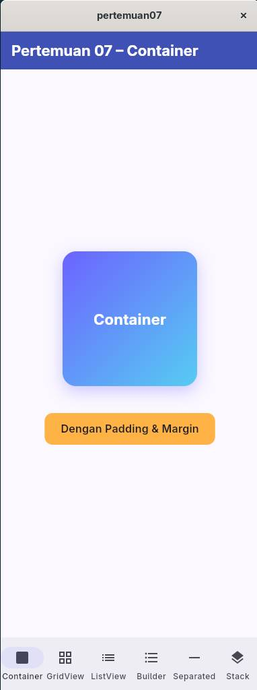
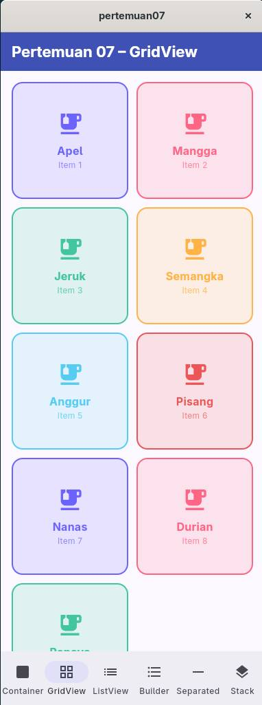
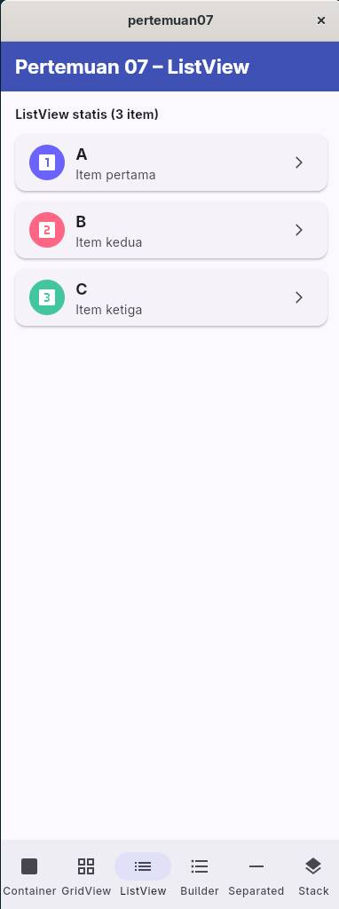
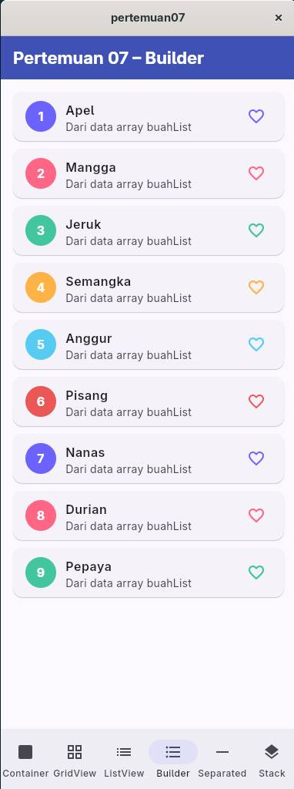
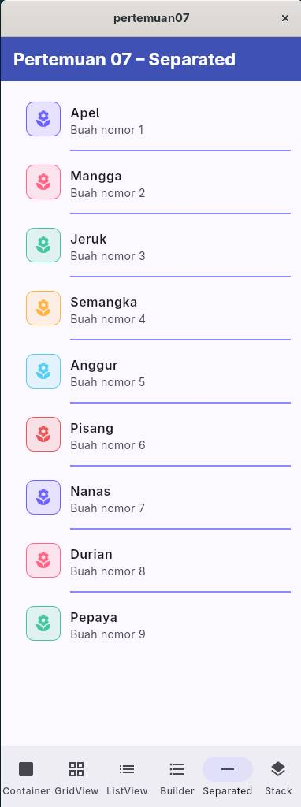
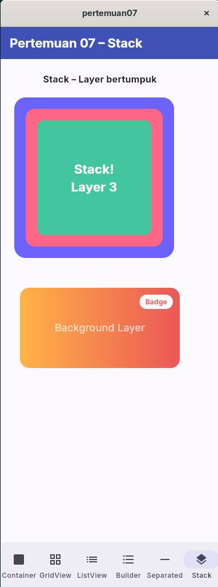

## Cara Menjalankan

```bash
cd PERTEMUAN07
flutter run
```

## Struktur Project

```
PERTEMUAN07/
├── lib/
│   └── main.dart   # Semua widget ada di sini (1 file)
└── README.md
```

Semua kode ada dalam **satu file** `lib/main.dart` dengan navigasi tab bawah untuk berpindah antar demo widget.

## Penjelasan Singkat Tiap Widget

### 1. `Container`
Widget kotak serbaguna yang bisa dikustomisasi dengan `width`, `height`, `color`, `decoration` (gradient, border-radius, shadow), `padding`, dan `margin`.

```dart
Container(
  width: 200, height: 200,
  decoration: BoxDecoration(
    gradient: LinearGradient(colors: [Colors.indigo, Colors.blue]),
    borderRadius: BorderRadius.circular(20),
  ),
  child: Text('Container'),
)
```

<details>
<summary>[ Gambar Container ]</summary>


</details>


### 2. `GridView`
Menampilkan item dalam tata letak **grid** (baris & kolom). Menggunakan `GridView.builder` agar efisien untuk daftar dinamis. `SliverGridDelegateWithFixedCrossAxisCount` mengatur jumlah kolom.

```dart
GridView.builder(
  gridDelegate: SliverGridDelegateWithFixedCrossAxisCount(crossAxisCount: 2),
  itemCount: list.length,
  itemBuilder: (context, index) => Card(...),
)
```

<details>
<summary>[ Gambar Gridview ]</summary>


</details>


### 3. `ListView`
Daftar **statis** yang children-nya ditulis langsung. Cocok untuk jumlah item yang sudah diketahui dan sedikit (contoh: 3 item A, B, C).

```dart
ListView(
  children: [
    ListTile(title: Text('A')),
    ListTile(title: Text('B')),
    ListTile(title: Text('C')),
  ],
)
```

<details>
<summary>[ Gambar ListView ]</summary>


</details>


### 4. `ListView.builder`
Daftar **dinamis** yang item-nya dibuat on-demand menggunakan fungsi `itemBuilder`. Efisien karena hanya merender item yang terlihat di layar. Cocok untuk data dari array/API.

```dart
ListView.builder(
  itemCount: dataList.length,
  itemBuilder: (context, index) => ListTile(title: Text(dataList[index])),
)
```

<details>
<summary>[ Gambar Builder ]</summary>


</details>


### 5. `ListView.separated`
Sama seperti `ListView.builder` tapi ditambahkan **pemisah** (separator) antar item menggunakan `separatorBuilder`. Contoh pemisah: `Divider`, `SizedBox`, dll.

```dart
ListView.separated(
  itemCount: list.length,
  separatorBuilder: (context, index) => Divider(),
  itemBuilder: (context, index) => ListTile(title: Text(list[index])),
)
```

<details>
<summary>[ Gambar Separated ]</summary>


</details>


### 6. `Stack`
Menumpuk widget **satu di atas yang lain** (z-axis). `Positioned` digunakan untuk mengatur posisi tepat tiap layer. Berguna untuk badge, overlay, kartu berlapis, dsb.

```dart
Stack(
  children: [
    Container(color: Colors.indigo),      // layer bawah
    Positioned(
      top: 20, left: 20,
      child: Container(color: Colors.pink), // layer atas
    ),
  ],
)
```

<details>
<summary>[ Gambar Stack ]</summary>


</details>
